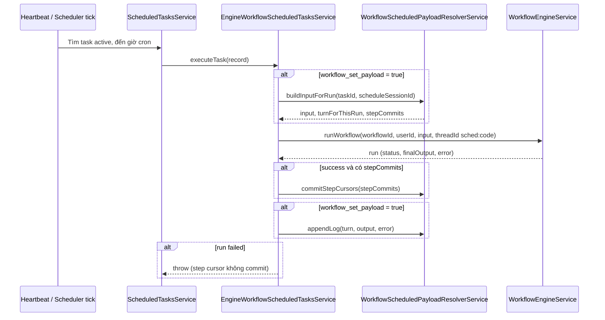
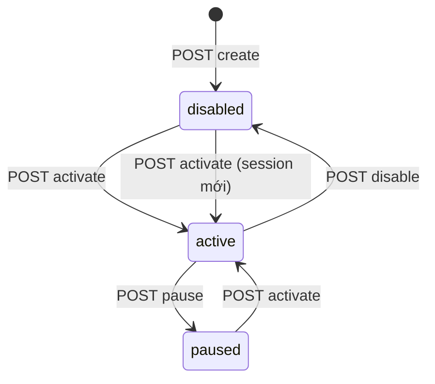

# Luồng xử lý: lịch workflow và payload động (`scheduled_tasks_workflow` + `scheduled_payloads`)

Tài liệu mô tả **end-to-end** cách user cấu hình lịch chạy workflow, cách hệ thống ghép `input`, khi nào ghi DB, và quan hệ với log — khớp với code hiện tại trong `src/agent/scheduler/`.

---

## 1. Khái niệm và bảng dữ liệu

| Thành phần | Vai trò |
|------------|---------|
| **`scheduled_tasks_workflow`** | Một “lịch” của user: `cron`, `workflow_id`, cờ **`workflow_set_payload`**, v.v. Khóa logic thường là `task_id` (id dòng workflow schedule). |
| **`scheduled_payloads`** | Các **rule** chỉnh sửa / sinh giá trị cho từng **khóa** trong object `input` gửi vào `workflow_run` khi `workflow_set_payload = true`. Mỗi task + `sp_key_name` là duy nhất. |
| **`sp_step_cursor`** | Chỉ dùng cho kiểu **`step`**: lưu số nguyên “cursor” sau mỗi lần chạy **thành công** (xem mục 5). |
| **`stw_schedule_session`** (trên `scheduled_tasks_workflow`) | UUID **phiên lịch**: so khớp với `log_tasks_workflow.ltw_session`. Đổi khi **activate** từ trạng thái **disabled** (section mới, turn lại từ 1); **giữ nguyên** khi resume từ **paused**. Không đổi khi chỉ restart server. |
| **`log_tasks_workflow`** | Nhật ký mỗi lượt trong một phiên (`ltw_session`): **`ltw_turn_in_session`** (1-based), output JSON, lỗi. Dùng để tính turn tiếp theo cho **`loop`** và audit. |

---

## 2. Trạng thái lịch (`status`) và API

- **Tạo mới** (`POST /`): lịch workflow mặc định **`disabled`** — **không** đăng ký cron cho đến khi kích hoạt.
- **`POST .../:taskId/activate`**: chỉ từ **`disabled`** hoặc **`paused`** → **`active`**.  
  - **`disabled` → `active`**: gán **`stw_schedule_session`** mới (UUID); các log/payload `loop` trong phiên cũ không còn khớp session → turn đầu trong phiên mới là **1**.  
  - **`paused` → `active`**: **giữ** session hiện tại; turn tiếp = **max(`ltw_turn_in_session`) trong cùng session + 1**.  
  Thực hiện qua `ScheduledTasksService.resume` (workflow disabled có nhánh đổi session).
- **`POST .../:taskId/pause`**: chỉ từ **`active`** → **`paused`** — gỡ cron ngay.
- **`POST .../:taskId/disable`**: chỉ từ **`active`** → **`disabled`** — gỡ cron ngay.
- **`PATCH .../:taskId`**: **không** còn trường `status` trong DTO — đổi trạng thái bằng `activate` / `pause` / `disable` bên dưới.

**CRUD `scheduled_payloads` (thêm / sửa / xóa input):** chỉ được khi lịch **`disabled`**. Nếu **`active`** hoặc **`paused`**, `POST` / `PATCH` / `DELETE` dưới `.../:taskId/payloads` trả **`403 Forbidden`** — tránh đổi rule input giữa các tick đang hoặc sắp chạy. **`GET`** danh sách / chi tiết payload **không** bị chặn. Luồng gợi ý: **`POST .../disable`** (khi đang `active`) hoặc đợi lịch ở `disabled` → chỉnh payload → **`activate`** lại.

### Xóa lịch (`DELETE .../:taskId`)

`scheduled_payloads` và `log_tasks_workflow` tham chiếu `task_id` với **`ON DELETE CASCADE`** — xóa dòng `scheduled_tasks_workflow` sẽ xóa luôn payload và log liên quan.

### Lỗi lặp và tự tắt (workflow)

- Mỗi lần cron **chỉ thử chạy workflow một lần** (không retry nhiều vòng trong cùng tick như task agent/n8n).
- Nếu tick **lỗi**, đếm **consecutive failures** +1, chờ tick cron sau.
- Sau **3 tick lỗi liên tiếp** (ngưỡng cấu hình global, mặc định 3): trạng thái chuyển sang **`disabled`** (khác agent/n8n là **`paused`**), cron được gỡ.

---

## 3. Cờ `workflow_set_payload`

- **`false` (mặc định)**  
  - Engine **không** đọc `scheduled_payloads`.  
  - **`input`** truyền vào workflow là `undefined` (workflow dùng default của engine).  
  - **Không** ghi `log_tasks_workflow` từ luồng này.

- **`true`**  
  - Trước mỗi lần chạy, `buildInputForRun(taskWorkflowId, scheduleSessionId)` được gọi (`scheduleSessionId` = `stw_schedule_session`).  
  - Nếu **không có dòng** `scheduled_payloads`: `input` vẫn có thể là `undefined`; log vẫn được ghi (turn vẫn tăng theo session).  
  - Nếu **có dòng**: mỗi dòng tạo một cặp **`keyName` → giá trị đã resolve** trong object `input`.

Khuyến nghị: bật `workflow_set_payload = true` chỉ khi đã (hoặc sẽ) cấu hình payload qua API; nếu không cần chỉnh input, để `false` để tránh log không cần thiết.

---

## 4. Luồng thực thi lịch (từ cron đến workflow)

**Điểm chính:**

1. Chỉ **`EngineWorkflowScheduledTasksService`** xử lý `targetType === WORKFLOW` (workflow chạy trong app), không nhầm với n8n workflow.
2. **`threadId`** cố định dạng `sched:{task.code}` để các lần chạy theo lịch dùng ngữ cảnh nhất quán nếu engine lưu theo thread.
3. Sau khi chạy xong:
   - **`step`**: cursor chỉ cập nhật khi **`run.status === SUCCEEDED`**.
   - **Log**: luôn append khi `workflow_set_payload` (kể cả run fail — vẫn ghi `error` và output nếu có).

---

## 5. Bốn kiểu `sp_type` (`ScheduledPayloadType`)

Trong API/DTO, khóa JSON input là **`keyName`** (cột `sp_key_name`), không phải tên kiểu. Giá trị cấu hình nằm trong **`sp_value`** (text).

### 5.1. `fixed`

- **Ý nghĩa**: Mỗi lần chạy, gán cố định một giá trị cho `input[keyName]`.
- **`sp_value`**: Chuỗi được parse thông minh:
  - `true` / `false` → boolean
  - `null` → null
  - Số nguyên / thập phân → number
  - Thử `JSON.parse` (object/array JSON hợp lệ)
  - Ngược lại → chuỗi gốc

**Không** dùng `sp_step_cursor`.

### 5.2. `step`

- **Ý nghĩa**: Giá trị gửi vào workflow là **số nguyên** = `(sp_step_cursor ?? 0) + Δ`, với **`Δ = sp_value`** (bắt buộc số nguyên **khác 0**, có thể âm hoặc dương).
- **Commit**: Sau khi workflow **chạy thành công**, `sp_step_cursor` được cập nhật thành **giá trị đã dùng trong lần chạy đó** (tức `prev + Δ`). Nếu run **thất bại**, cursor **không** đổi — lần sau vẫn tính từ cursor cũ.

### 5.3. `loop`

- **Ý nghĩa**: `sp_value` là danh sách token tách bằng **`,` hoặc `;`**, khoảng trắng quanh token được trim (chấp nhận `"a, b, c"` hoặc `"a;b;c"`).
- **Chọn phần tử**: chỉ số `((turnForThisRun - 1) % list.length)` — **`turnForThisRun` là 1-based** trong phiên (`ltw_session` hiện hành).
- Token nhìn giống số nguyên/thập phân thì ép kiểu number, không thì giữ string.

**Không** dùng `sp_step_cursor`.

### 5.4. `random`

- **Ý nghĩa**: Cùng định dạng danh sách như `loop`.
- **Chọn phần tử**: **ngẫu nhiên đều** một phần tử trong mỗi lần chạy (không phụ thuộc turn).
- Ép kiểu token giống `loop`.

### 5.5. Điều kiện `sp_value` khi **tạo/sửa** payload (API — giống popup “Thêm input payload”)

Backend (`WorkflowScheduleService.validatePayloadValue`) kiểm tra **trước khi lưu**; nếu sai trả **400** với `message` tương ứng.

| `payloadType` | Điều kiện `sp_value` (sau khi `trim`) |
|---------------|----------------------------------------|
| **fixed** | **Không rỗng.** Không ép định dạng thêm ở API — chuỗi hợp lệ hay không (**JSON**, số, boolean…) chỉ được **parse khi chạy workflow** (`parseFixed` trong resolver). Gửi JSON sai cú pháp có thể tới lúc chạy mới lỗi / fallback chuỗi tùy resolver. |
| **step** | **Số nguyên** (regex `[-+]?\d+`), **≠ 0** (âm/dương đều được). |
| **loop** | **Ít nhất một token** sau khi tách theo **`,` hoặc `;`** (trim từng token). Toàn khoảng trắng / không có token → 400. |
| **random** | Giống **loop** (danh sách không được rỗng sau khi tách). |

**Chung:** `sp_value` không được để trống hoàn toàn sau trim → **`sp_value is required`**.

**Lưu ý:** Trường body là **`sp_value`**; response có thêm **`value`** (cùng nội dung) và **`sp_value`** alias — xem mục 7.

---

## 6. Cách tính `turn` (ảnh hưởng `loop`)

Trong `buildInputForRun`:

1. `scheduleSessionId` = **`stw_schedule_session`** của dòng `scheduled_tasks_workflow`.
2. Query **`MAX(ltw_turn_in_session)`** trong `log_tasks_workflow` cho đúng task + **`ltw_session = scheduleSessionId`**.
3. Nếu chưa có log trong phiên → max = **0**.
4. **`turnForThisRun = max + 1`** (lần đầu trong phiên = **1**).

Sau mỗi lần chạy có `workflow_set_payload`, log append với `turnInSession = turnForThisRun` — **kể cả run fail** — nên lượt sau `loop` vẫn tăng (khác `step` chỉ commit cursor khi success).

---

## 7. API REST (user JWT)

**URL thực tế (app hiện tại):** prefix toàn cục `api/v1` (`main.ts`) → base **`/api/v1/agent/scheduled-workflows`**.  
**Auth:** header `Authorization: Bearer <JWT>`; user chỉ thao tác trên lịch của chính mình (`uid` từ token).

**`task_code` (`schedule.code`):** không nhận từ client khi **POST/PATCH** — sinh tự động `{slug(name)}_{unixTimestamp}` (ví dụ `chuong_trinh_a_1714640400`). Khi **đổi `name`** (chuỗi sau trim khác trước đó), hệ thống **sinh lại mã** cùng quy tắc. Trùng hiếm gặp → thêm hậu tố ngẫu nhiên.

**Lịch chạy — XOR `cronExpression` hoặc `intervalMinutes`:**

- **`intervalMinutes`** (số nguyên, **tối thiểu 5**): backend cố gắng chuyển sang một biểu thức cron đơn; nếu **không biểu diễn được** (ví dụ **95** phút) → **400** với thông báo có dạng “**1 giờ 35 phút** (95 phút) …”.
- Các dạng **được hỗ trợ** gồm: **5–59** → `*/N * * * *`; **60** → mỗi giờ; **bội 120–1380** của 60 (120, 180, …) → mỗi vài giờ tại phút 0; **1440** → mỗi ngày `0 0 * * *`.
- Không gửi **đồng thời** `cronExpression` và `intervalMinutes`.

**OpenAPI / Swagger UI:** **`/api/docs`** (không nằm dưới `api/v1`). Nhóm tag **`agent/scheduled-workflows`**. Lưu ý app bọc mọi JSON thành công trong **`{ statusCode, message, data }`** — schema trong Swagger mô tả **phần `data`**.

| Method | Đường dẫn (sau prefix) | Mô tả |
|--------|------------------------|--------|
| `GET` | `/` | Danh sách lịch workflow của user |
| `POST` | `/` | Tạo lịch (`CreateWorkflowScheduleDto`) |
| `GET` | `/:taskId` | Chi tiết lịch + payloads |
| `PATCH` | `/:taskId` | Cập nhật lịch |
| `DELETE` | `/:taskId` | Xóa lịch (CASCADE payload + log) |
| `POST` | `/:taskId/activate` | `disabled` \| `paused` → `active` (quy tắc session như mục 2) |
| `POST` | `/:taskId/pause` | `active` → `paused` |
| `POST` | `/:taskId/disable` | `active` → `disabled` |
| `GET` | `/:taskId/runs` | Lịch sử lượt chạy (`log_tasks_workflow`), query **`page`** (mặc 1), **`limit`** (mặc 20, tối đa 100); sort **`id` DESC** (mới nhất trước) |
| `GET` | `/:taskId/payloads` | Chỉ danh sách payload rows (luôn được, mọi `status`) |
| `POST` | `/:taskId/payloads` | Thêm payload (`keyName`, `payloadType`, `sp_value`) — **chỉ khi lịch `disabled`**; `active` \| `paused` → **403** |
| `GET` | `/:taskId/payloads/:payloadId` | Một payload (mọi `status`) |
| `PATCH` | `/:taskId/payloads/:payloadId` | Sửa payload — **chỉ khi `disabled`**; `active` \| `paused` → **403** |
| `DELETE` | `/:taskId/payloads/:payloadId` | Xóa payload — **chỉ khi `disabled`**; `active` \| `paused` → **403** |

**Lưu ý routing**: Các route có đoạn **`payloads`**, **`runs`**, **`activate`**, … được khai báo **trước** `GET|PATCH|DELETE :taskId` thuần, tránh nhầm segment động với id.

**Validation phía API** (chi tiết đầy đủ theo từng type: **mục 5.5**).

**Điều kiện trạng thái lịch (payload):** `WorkflowScheduleService.assertWorkflowPayloadsMutable` — xem đoạn **CRUD payload** ở **mục 2**.

Khi đổi kiểu payload **không** còn `step`, hoặc chuyển sang `step` từ kiểu khác, service có thể **reset `stepCursor`** về `null` theo logic trong `WorkflowScheduleService.updatePayload`.

### 7.1. Hình dạng response (cho TypeScript / OpenAPI)

| Endpoint | HTTP | Body response (khái quát) |
|----------|------|---------------------------|
| `GET /` | 200 | **Mảng** bản ghi lịch workflow (`targetType === 'workflow'`). Mỗi phần tử là object phẳng giống `IScheduledTaskRecord`: `id`, `code`, `name`, `cronExpression`, `workflowId`, `workflowSetPayload`, **`scheduleSessionId`** (UUID), **`status`** (`active` \| `paused` \| `disabled`), `lastRunAt`, `lastSuccessAt`, `lastError`, **`consecutiveFailures`**, `totalFailures`, `totalSuccesses`, `maxRetries`, `timeoutMs`, … |
| `POST /` | 200/201* | Một bản ghi lịch như trên; **`status` mặc định `disabled`**. |
| `GET /:taskId` | 200 | **`{ schedule, payloads }`**: `schedule` như một phần tử trong list; `payloads` là mảng payload API (có **`value`** + **`sp_value`**, xem bảng dưới). |
| `GET /:taskId/runs` | 200 | **`{ items, total, page, limit, totalPages }`** — `items` là các dòng log (`id`, `taskWorkflowId`, `sessionId`, `turnInSession`, `output`, `error`). |
| `PATCH /:taskId` | 200 | Bản ghi lịch đã cập nhật (**không** gửi `status` trong body). |
| `DELETE /:taskId` | 200 | **`{ ok: true }`** — payload & log CASCADE theo DB. |
| `POST /activate` \| `pause` \| `disable` | 200 | Bản ghi lịch đầy đủ sau khi đổi trạng thái. |
| `GET` … `/payloads` | 200 | Payload API (cùng shape bảng dưới). |
| `POST` / `PATCH` / `DELETE` … `/payloads` | **200** hoặc **403** | **200**: payload API hoặc `{ ok: true }` (xóa) — **chỉ khi** `schedule.status === 'disabled'`. **403**: lịch **`active`** hoặc **`paused`** (message: disable schedule first). |

\*Nest thường trả 200 cho `@Post()` trừ khi bạn chỉnh `@HttpCode`.

**Một dòng `scheduled_payloads` khi serialize JSON (tên field API ↔ DB):**

| JSON key | Ý nghĩa |
|----------|---------|
| `id` | `sp_id` |
| `taskWorkflowId` | FK task |
| `keyName` | `sp_key_name` — khóa trong object `input` workflow |
| `payloadType` | `fixed` \| `step` \| `loop` \| `random` |
| **`value`** | **Giá trị cấu hình** (cột `sp_value`). |
| **`sp_value`** | **Trùng `value`** — thêm vào response để khớp tên field của body POST/PATCH (giảm nhầm lẫn FE). |
| `stepCursor` | Chỉ `step`; số đã commit sau lần chạy thành công trước |

**Body create/update payload:** vẫn chỉ gửi **`sp_value`** (hoặc các field optional của `UpdateScheduledPayloadDto`); không bắt buộc gửi `value`.

---

## 8. File code tham chiếu nhanh

| Chủ đề | File |
|--------|------|
| Ghép `input`, turn, step commit, log | `workflow-scheduled-payload-resolver.service.ts` |
| Chạy workflow + thứ tự commit log | `engine-workflow-scheduled-tasks.service.ts` |
| CRUD HTTP + khóa payload theo `status` | `workflow-schedule.controller.ts`, `workflow-schedule.service.ts` (`assertWorkflowPayloadsMutable`) |
| Swagger schema (response payload / runs) | `dto/workflow-schedule.swagger.dto.ts` |
| DTO | `dto/workflow-schedule.dto.ts` |
| Enum kiểu payload | `entities/scheduled-payload-type.enum.ts` |
| Session per schedule + resume | `scheduled-tasks.service.ts` (`resume`), cột `stw_schedule_session` |
| Dispatch theo `targetType` | `scheduled-tasks.service.ts` → `executeWithTimeout`, `executeTick` |

---

## 9. Ví dụ minh họa ngắn

**Lịch** có `workflow_set_payload: true` và hai dòng payload:

1. `keyName: "topic"`, `fixed`, `sp_value: "\"hello\""` hoặc chuỗi JSON tùy ý → `input.topic` cố định sau parse.
2. `keyName: "offset"`, `step`, `sp_value: "3"` → lần 1: 0+3=3, sau success cursor=3; lần 2: 3+3=6, …

**Loop** `sp_value: "Mon,Tue,Wed"` — turn 1 → Mon, 2 → Tue, 3 → Wed, 4 → Mon, … trong cùng `stw_schedule_session`.

**Random** cùng danh sách — mỗi lần một phần tử ngẫu nhiên.

---

## 10. Hướng dẫn UI / frontend

### 10.1. Luồng người dùng gợi ý

1. **Tạo lịch** (`POST /`) — cron + `workflowId`; nhận `status: disabled`.  
2. Khi lịch **`disabled`**: (tuỳ chọn) bật **`workflowSetPayload`** và **thêm / sửa payload** (`POST` / `PATCH` … `/payloads`). **Sau khi `active` hoặc `paused`**, UI nên **ẩn hoặc vô hiệu hóa** thêm-sửa-xóa payload (API trả **403**).  
3. **`POST .../activate`** — lịch chạy theo cron; hiển thị trạng thái **active**.  
4. Cần đổi payload: chỉ khi lịch **`disabled`**. Từ **`active`**: `POST .../disable` → CRUD payload → `activate`. Từ **`paused`**: API **không** có `paused` → `disable`; cần **`activate`** (lên `active`, cron chạy lại) rồi **`disable`**, sau đó chỉnh payload — nếu hay sửa payload, nên **`disable`** khi còn `active` thay vì chỉ `pause`.  
5. **`pause` / `disable`** khi cần dừng; **`activate`** lại từ paused hoặc disabled.

### 10.2. Máy trạng thái (nút & điều kiện)

| `schedule.status` | Nút / hành động UI (gợi ý) |
|--------------------|----------------------------|
| `disabled` | Hiện **Kích hoạt** → `POST .../activate`. Cho phép **PATCH** lịch (`/:taskId`) và **CRUD payload** (`/payloads`). |
| `active` | **Tạm dừng** (`pause`), **Tắt hẳn** (`disable`). Cho phép **PATCH** lịch (cron, tên, …) nhưng **không** thêm/sửa/xóa dòng **payload** (403). |
| `paused` | **Tiếp tục** → `activate` (giữ session & chuỗi turn). **Không** CRUD payload (403) — cần **`disabled`** để chỉnh payload. |

**Lưu ý:** `pause` và `disable` chỉ khi đang **`active`**; **`activate`** khi đã **`active`** → **400** (`Schedule is already active`). Không có **`disable`** trực tiếp từ **`paused`** — có thể ẩn nút “Tắt” hoặc dùng hai bước nếu cần.

### 10.3. Trường nên hiển thị trên dashboard

| Trường | Gợi ý UI |
|--------|----------|
| `status` | Badge theo `active` / `paused` / `disabled`. |
| `cronExpression` | Text hoặc mô tả đọc được (parser cron phía client). |
| `workflowId` | Link tới màn workflow nếu có. |
| `workflowSetPayload` | Toggle/icon; nếu `true` mà chưa có payload, cảnh báo nhẹ. |
| `lastRunAt`, `lastSuccessAt` | Lần chạy / thành công gần nhất. |
| `lastError` | Banner/cột lỗi. |
| `consecutiveFailures` | Cảnh báo; đạt ngưỡng (mặc định 3) backend có thể tự **`disabled`** — nên refetch danh sách định kỳ hoặc khi focus trang. |
| `scheduleSessionId` | Ẩn mặc định; “Copy” cho support/debug. |

### 10.4. Xử lý lỗi HTTP

| Mã | Tình huống |
|----|------------|
| **400** | Transition không hợp lệ; validation payload (`sp_value`, trùng `keyName`). |
| **401** | JWT thiếu / hết hạn. |
| **403** | JWT hợp lệ nhưng **không được** thao tác — ví dụ **thêm/sửa/xóa payload** khi lịch **`active`** hoặc **`paused`** (phải `disable` trước). |
| **404** | Sai `taskId` hoặc không thuộc user; sai `payloadId`. |

### 10.5. Lịch sử lượt chạy

- **`GET .../:taskId/runs?page=&limit=`** trả về log phân trang (xem mục 7). Dùng cho tab “Lịch sử” / debug **`loop`** / **`turnInSession`**.

### 10.6. Kết luận cho product / FE

API **đủ** cho MVP: CRUD lịch + payload, ba thao tác trạng thái, **`runs`** phân trang, **`sp_value`** đi kèm **`value`** trên payload response. **Swagger** tại **`/api/docs`** (Bearer JWT). Envelope toàn cục **`{ statusCode, message, data }`** — generator client nên unwrap `data`.

---

*Tài liệu phản ánh hành vi code tại thời điển viết; nếu refactor scheduler, cần cập nhật mục tương ứng.*
